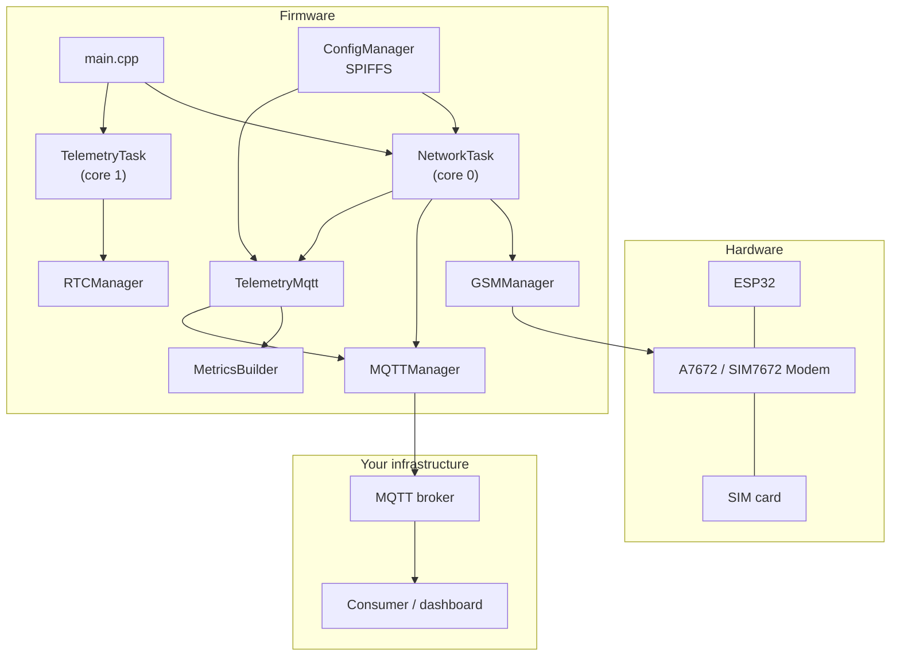
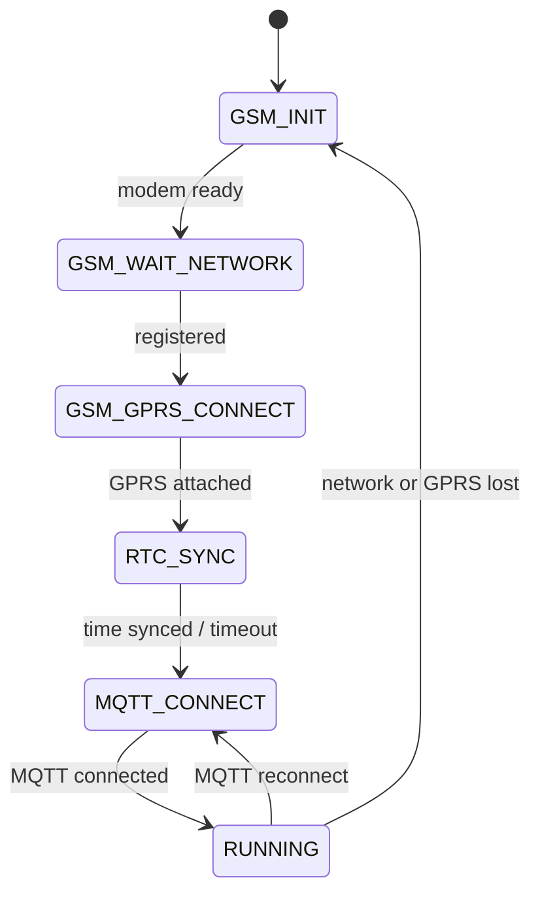
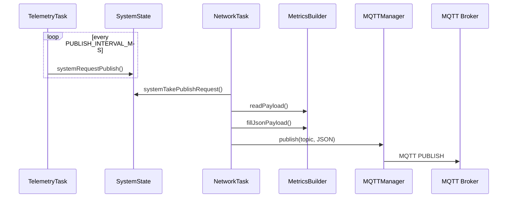

# ESP32 4G LTE A7672 MODULE
ready to used sorce code

Reference firmware for **ESP32 + A7672 / SIM7672S (VVM501-class) 4G LTE** boards that publish **MQTT telemetry** over cellular — for **automation and remote monitoring** (sensors, digital I/O, Modbus devices, real-time dashboards).

This folder is meant to be **shared and reused**: configuration and JSON payload are **blank templates** with comments showing where to add your own values and fields.

---

## What this project does


| Layer        | Responsibility                                                                     |
| ------------ | ---------------------------------------------------------------------------------- |
| **GSM / 4G** | Modem power, network registration, GPRS attach, APN (auto-detect or config)        |
| **MQTT**     | Connect to your broker, publish periodic JSON telemetry                            |
| **FreeRTOS** | `NetworkTask` (modem + MQTT) on core 0, `TelemetryTask` (interval timer) on core 1 |
| **Config**   | `config.env` + optional `config.local.env` on SPIFFS (no secrets in git)           |
| **Payload**  | You define struct + JSON mapping in `metrics_builder.`*                            |


---


## Hardware

- **MCU:** ESP32 (`esp32dev`)
- **Modem:** SIM7672S / A7672S (TinyGSM `SIM7600` profile)
- **Typical wiring (VVM501 internal UART):**


| Signal            | ESP32 GPIO |
| ----------------- | ---------- |
| Modem RX ← ESP TX | GPIO 26    |
| Modem TX → ESP RX | GPIO 27    |
| Modem PWR key     | GPIO 4     |
| Status LED        | GPIO 2     |


Change pins in `include/gw_config.h` if your board differs.

---


## Quick start


### 1. Install tools

- [PlatformIO](https://platformio.org/) (VS Code extension or CLI)
- USB driver for ESP32 serial port


### 2. Configure device & MQTT

```powershell
cd "ESP32 4G LTE A7672 MODULE"
copy data\config.local.env.example data\config.local.env
```

Edit `data/config.local.env`:

```env
DEVICE_ID=GW-EXAMPLE-001
ASSET_ID=ASSET-EXAMPLE-001
TENANT_ID=tenant-example
MQTT_BROKER=192.168.1.100
MQTT_PORT=1883
MQTT_CLIENT_USER=mqtt_user
MQTT_CLIENT_PASS=mqtt_password
MQTT_METRICS_TOPIC=devices/telemetry
APN=internet
PUBLISH_INTERVAL_MS=60000
```

> `config.local.env` is **gitignored**. Never commit real passwords.


### 3. Build & upload

```bash
pio run -t uploadfs    # SPIFFS: config files
pio run -t upload      # firmware
pio device monitor     # serial log @ 115200
```


### 4. Customize MQTT payload


| File                              | What to change                                                  |
| --------------------------------- | --------------------------------------------------------------- |
| `src/metrics/metrics_builder.h`   | Add fields to `TelemetryPayload`                                |
| `src/metrics/metrics_builder.cpp` | `readPayload()` — read sensors; `fillJsonPayload()` — JSON keys |
| `src/mqtt/telemetry_mqtt.cpp`     | Root JSON envelope (`ID`, `DT`, `DATA`, tenant/asset keys)      |


**Default published JSON (template):**

```json
{
  "ID": "YOUR_DEVICE_ID",
  "DT": "1735689600",
  "DATA": {
    "field_a": "0.0000",
    "field_b": "0.0000"
  }
}
```

Replace `field_a` / `field_b` with your automation metrics (temperature, tank level, door status, motor run, flow, etc.). See [Sensor integration for automation](#sensor-integration-automation) below.

---


## Sensor integration (automation)

This gateway is a **cellular MQTT pipe**. You attach whatever automation I/O your site needs and map it in `metrics_builder.`*.

### What you can connect


| Type             | Examples                                 | Interface               |
| ---------------- | ---------------------------------------- | ----------------------- |
| Environmental    | Temperature, humidity, air quality       | I2C sensor              |
| Level / pressure | Tank, sump, line pressure                | ADC (4–20 mA) or Modbus |
| Digital status   | Door, limit switch, motor contact, alarm | GPIO input              |
| Pulse / total    | Water/gas flow meter                     | GPIO interrupt          |
| Field bus        | Energy meter, VFD, remote I/O            | RS-485 Modbus RTU       |


### Where to edit code

1. `src/metrics/metrics_builder.h` — add struct fields (`temperature_c`, `door_open`, …)
2. `src/metrics/metrics_builder.cpp` — `readPayload()`: read hardware; `fillJsonPayload()`: JSON keys
3. `src/mqtt/telemetry_mqtt.cpp` — root envelope (`ID`, `DT`, `DATA`, optional `tenant_id`)

**Example automation JSON** (after you customize):

```json
{
  "ID": "GW-PLANT-01",
  "DT": "1735689600",
  "DATA": {
    "temp_c": "26.5000",
    "humidity_pct": "58.0000",
    "tank_level_pct": "72.3000",
    "door_open": "0",
    "motor_run": "1"
  }
}
```

Real-time: `TelemetryTask` fires every `PUBLISH_INTERVAL_MS` → sensors sampled → MQTT publish over 4G.

Reuse driver patterns from the main repo `[sensors/](../sensors/)` folder (I2C, digital, analog, Modbus). Full guide: [docs/cellular/esp32-a7672-gateway.md](../docs/cellular/esp32-a7672-gateway.md).

---


## Architecture


### System overview




### Connection state machine




### Telemetry data flow




---


## Project layout

```
ESP32 4G LTE A7672 MODULE/
├── data/
│   ├── config.env                 # Template keys (YOUR_* placeholders)
│   ├── config.local.env.example   # Example filled values
│   └── config.local.env           # YOUR secrets (create locally, gitignored)
├── include/
│   ├── gw_config.h                # Pins, baud, SPIFFS paths
│   ├── gw_types.h                 # State enums
│   └── rtos_config.h              # Task stacks / cores
├── src/
│   ├── main.cpp
│   ├── config/                    # SPIFFS config loader
│   ├── gsm/                       # TinyGSM wrapper + APN detect
│   ├── mqtt/                      # MQTT client + telemetry publisher
│   ├── metrics/                   # *** CUSTOMIZE payload here ***
│   ├── rtc/                       # UTC time from GSM
│   ├── rtos/                      # Network + telemetry tasks
│   └── utils/                     # Serial logger
├── tools/
│   └── verify_mqtt.py             # Optional: listen on broker
└── platformio.ini
```

---


## Configuration reference


| Key                                     | Description                                                 |
| --------------------------------------- | ----------------------------------------------------------- |
| `DEVICE_ID`                             | MQTT client base id (suffix `-XXXX` from IMEI may be added) |
| `ASSET_ID`                              | Optional asset id (use in JSON — see `telemetry_mqtt.cpp`)  |
| `TENANT_ID`                             | Optional tenant id                                          |
| `MQTT_BROKER`                           | Broker hostname or IP                                       |
| `MQTT_PORT`                             | Usually `1883` (TLS not included in this template)          |
| `MQTT_CLIENT_USER` / `MQTT_CLIENT_PASS` | Broker credentials                                          |
| `MQTT_METRICS_TOPIC`                    | Topic for telemetry publish                                 |
| `APN`                                   | Cellular APN; leave empty for auto-detect                   |
| `PUBLISH_INTERVAL_MS`                   | Telemetry period (default 60000 ms)                         |


---


## Verify MQTT (optional)

On your PC (set env vars to match `config.local.env`):

```bash
pip install paho-mqtt
set MQTT_BROKER=192.168.1.100
set MQTT_USER=mqtt_user
set MQTT_PASS=mqtt_password
set MQTT_TOPIC=devices/telemetry
python tools/verify_mqtt.py GW-EXAMPLE-001
```

---


## Troubleshooting


| Symptom                         | Check                                                           |
| ------------------------------- | --------------------------------------------------------------- |
| Config shows `YOUR_*` on serial | Run `pio run -t uploadfs` after editing `data/config.local.env` |
| No network / CSQ low            | Antenna, SIM active, operator coverage                          |
| GPRS fails                      | Set correct `APN` in config; check SIM data plan                |
| MQTT connect fail               | Broker IP, firewall, username/password, port                    |
| Empty payload                   | Implement `MetricsBuilder::readPayload()` for your sensors      |


---


## Author

**Suraj Rathod** — [MR-SURAJ-RATHOD](https://github.com/MR-SURAJ-RATHOD)

---


## License

Part of the [IOT-POC](https://github.com/suraj-iot-engineer/IOT-POC) reference repository. Use and adapt for your projects; keep secrets out of git.